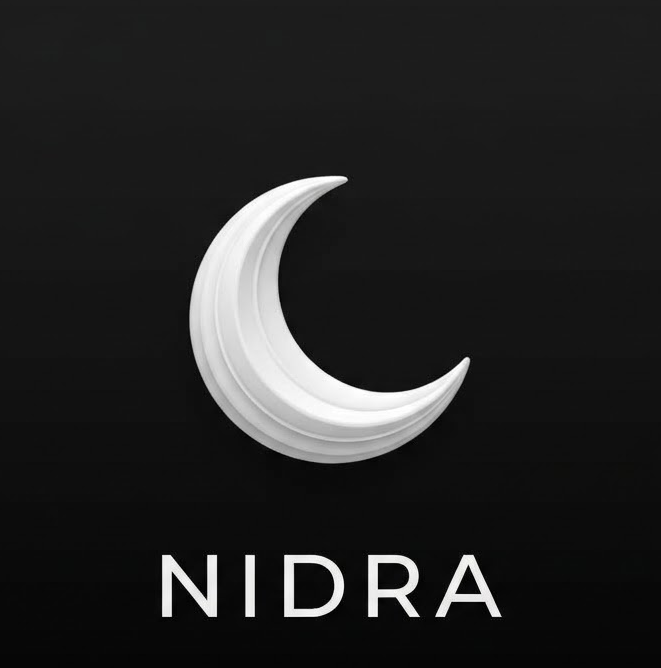
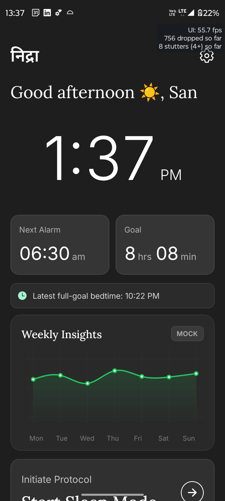
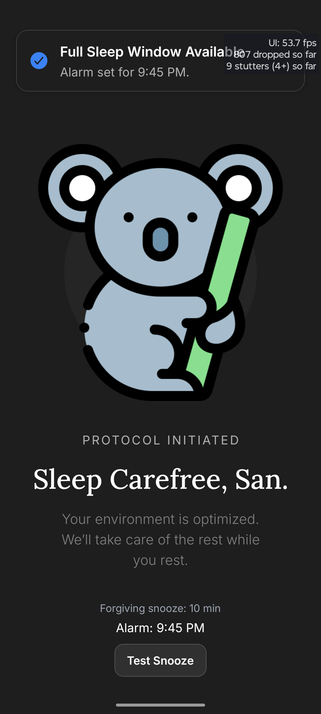
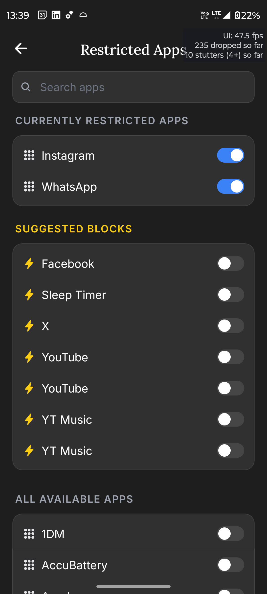

<!--
Hey, thanks for using the awesome-readme-template template.  
If you have any enhancements, then fork this project and create a pull request 
or just open an issue with the label "enhancement".

Don't forget to give this project a star for additional support ;)
Maybe you can mention me or this repo in the acknowledgements too
-->
<div align="center">

  
  <h1>Nidra</h1>
  
  <p>
    An uncompromising sleep-enforcement and behavioral-modification platform for Android.
  </p>
  
<!-- Badges -->
<p>
  <a href="https://github.com/sanskar-sol/Nidra-app/graphs/contributors">
    
  </a>
  <a href="https://github.com/sanskar-sol/Nidra-app/commits/main">
    
  </a>
  <a href="https://github.com/sanskar-sol/Nidra-app/network/members">
    
  </a>
  <a href="https://github.com/sanskar-sol/Nidra-app/stargazers">
    
  </a>
  <a href="https://github.com/sanskar-sol/Nidra-app/issues/">
    
  </a>
  <a href="https://github.com/sanskar-sol/Nidra-app/blob/main/LICENSE">
    
  </a>
</p>
   
<h4>
    <a href="https://github.com/sanskar-sol/Nidra-app#readme">View Demo</a>
  <span> · </span>
    <a href="https://github.com/sanskar-sol/Nidra-app">Documentation</a>
  <span> · </span>
    <a href="https://github.com/sanskar-sol/Nidra-app/issues/">Report Bug</a>
  <span> · </span>
    <a href="https://github.com/sanskar-sol/Nidra-app/issues/">Request Feature</a>
  </h4>
</div>

<br />

<!-- Table of Contents -->
# Table of Contents

- [About the Project](#about-the-project)
  * [Screenshots](#screenshots)
  * [Tech Stack](#tech-stack)
  * [Features](#features)
  * [Color Reference](#color-reference)
  * [Environment Variables](#environment-variables)
- [Getting Started](#getting-started)
  * [Prerequisites](#prerequisites)
  * [Installation](#installation)
  * [Running Tests](#running-tests)
  * [Run Locally](#run-locally)
  * [Deployment](#deployment)
- [Usage](#usage)
- [Roadmap](#roadmap)
- [Contributing](#contributing)
  * [Code of Conduct](#code-of-conduct)
- [FAQ](#faq)
- [License](#license)
- [Contact](#contact)
- [Acknowledgements](#acknowledgements)

<!-- About the Project -->
## About the Project

**Project Nidra** is an intelligent, tamper-resistant sleep-enforcement application built for Android. Unlike conventional alarm clocks or basic screen-time trackers, Nidra couples rigorous behavioral psychology with OS-level enforcement to physically prevent bedtime digital distraction and ensure consistent circadian rhythms.

### Key Highlights
- **Hardware & OS-Level Enforcement:** Leverages Android's `AccessibilityService` and `WindowManager` system overlays to detect and immediately block distracting apps in real time with zero polling latency.
- **Responsibility-Capped Alarm Algorithm:** Dynamically balances desired sleep durations against rigid morning obligations, calculating precise sleep debt deficits.
- **Doze-Proof Alarm Engine:** Utilizes `AlarmManager.setExactAndAllowWhileIdle` to guarantee precision wake-ups even when Android enters deep sleep / Doze mode.
- **Friction-Engineered Tamper Resistance:** Quitting an active sleep session requires a 15-second continuous press followed by a strict 5-step confirmation barrier.
- **Hardware-Encrypted Security:** Sensitive behavioral data and credentials are encrypted at rest using AES-256 via the Android Keystore and `expo-secure-store`.

<!-- Screenshots -->
### Screenshots

<div align="center">
  
  &nbsp;&nbsp;&nbsp;&nbsp;
  
  &nbsp;&nbsp;&nbsp;&nbsp;
  
</div>

<!-- Tech Stack -->
### Tech Stack

<details>
  <summary>Client (Presentation Layer)</summary>
  <ul>
    <li><a href="https://reactnative.dev/">React Native (0.81.5) - New Architecture</a></li>
    <li><a href="https://expo.dev/">Expo SDK 54</a></li>
    <li><a href="https://docs.expo.dev/router/introduction/">Expo Router v6</a></li>
    <li><a href="https://github.com/FormidableLabs/victory-native">Victory Native (v41)</a></li>
    <li><a href="https://shopify.github.io/react-native-skia/">React Native Skia (GPU Canvas Engine)</a></li>
    <li><a href="https://docs.swmansion.com/react-native-reanimated/">React Native Reanimated</a></li>
    <li><a href="https://github.com/software-mansion/react-native-gesture-handler">React Native Gesture Handler</a></li>
  </ul>
</details>

<details>
  <summary>Application Logic & State Layer</summary>
  <ul>
    <li><a href="https://www.typescriptlang.org/">TypeScript (5.9)</a></li>
    <li><a href="https://zustand.docs.pmnd.rs/">Zustand (v5)</a></li>
    <li><a href="https://docs.expo.dev/versions/latest/sdk/securestore/">Expo SecureStore (AES-256 Encrypted)</a></li>
    <li><a href="https://day.js.org/">Day.js</a></li>
  </ul>
</details>

<details>
<summary>Native Android Layer</summary>
  <ul>
    <li><a href="https://kotlinlang.org/">Kotlin</a></li>
    <li><a href="https://developer.android.com/reference/android/accessibilityservice/AccessibilityService">Android AccessibilityService (Event-Driven Blocker)</a></li>
    <li><a href="https://developer.android.com/reference/android/view/WindowManager">WindowManager System Overlays (TYPE_APPLICATION_OVERLAY)</a></li>
    <li><a href="https://developer.android.com/reference/android/app/AlarmManager">Android AlarmManager (Exact RTC_WAKEUP)</a></li>
    <li><a href="https://developer.android.com/reference/android/content/SharedPreferences">SharedPreferences (Native Crash-Resilient Storage)</a></li>
  </ul>
</details>

<details>
<summary>Tooling & DevOps</summary>
  <ul>
    <li><a href="https://docs.expo.dev/eas/">Expo Application Services (EAS Build)</a></li>
    <li><a href="https://gradle.org/">Gradle Build System</a></li>
    <li><a href="https://eslint.org/">ESLint</a></li>
  </ul>
</details>

<!-- Features -->
### Features

- 🛡️ **Event-Driven App Blocking:** Detects `TYPE_WINDOW_STATE_CHANGED` OS events without polling loops, instantly obscuring restricted apps with an un-bypassable system overlay while consuming negligible battery.
- ⏰ **Responsibility-Capped Alarm Math:** Automatically determines whether bedtime fits your designated wake target, adjusting alarm intervals and computing sleep debt deficits in real time.
- 🔒 **High-Friction Sleep Lockout:** Disables Android hardware back buttons and gesture navigation; mandates a 15-second long press and a 5-step confirmation gauntlet to break protocol.
- 📊 **GPU-Accelerated Analytics:** Employs Victory Native on Skia to render smooth 60fps sleep trends, goal tracking, and debt analytics directly via hardware canvas pipelines.
- 📴 **Doze-Proof Wake Alarm:** Employs Android's `setExactAndAllowWhileIdle` system alarms, waking device hardware even if the app process has been killed or suspended.
- ⚙️ **Integrated Blocker Diagnostics:** Built-in validation suite to verify `SYSTEM_ALERT_WINDOW` and Accessibility service configurations with one-tap deep links to system settings.

<!-- Color Reference -->
### Color Reference

| Color | Hex | Swatch |
| :--- | :--- | :--- |
| **Dark Base Background** | `#151718` |  |
| **Surface / Card Base** | `#1E1E1E` |  |
| **Primary Accent** | `#3B82F6` |  |
| **Success / Active State** | `#22C55E` |  |
| **Destructive / Warning** | `#EF4444` |  |
| **Warning / Distractor Highlight** | `#FACC15` |  |
| **Primary Text** | `#ECEDEE` |  |

<!-- Env Variables -->
### Environment Variables

Nidra manages secure configuration and state locally through encrypted storage. If integrating custom analytics, backend sync, or EAS cloud credentials, configure the following in your `.env` or `app.json`:

`EXPO_PUBLIC_APP_VARIANT`

`EAS_PROJECT_ID`

<!-- Getting Started -->
## Getting Started

### Prerequisites

Ensure your development environment meets the following specifications:
- **Node.js**: `v18.x` or `v20.x`
- **Package Manager**: `npm` (v9+) or `yarn` (v1.22+)
- **Android SDK & Build Tools**: API Level 34+ (Android 14/15)
- **Java Development Kit (JDK)**: OpenJDK 17
- **Physical Android Device** (Recommended for testing AccessibilityService & System Overlays) or Android Emulator with Google APIs.

```bash
# Verify Node and Java installations
node --version
javac -version
```

<!-- Installation -->
### Installation

1. Clone the repository:
```bash
git clone https://github.com/sanskar-sol/Nidra-app.git
cd Nidra-app
```

2. Install JavaScript and native module dependencies:
```bash
npm install
```

<!-- Running Tests -->
### Running Tests & Linting

Run TypeScript typechecks and ESLint code validation:

```bash
npm run lint
```

<!-- Run Locally -->
### Run Locally

Because Nidra relies on custom native Kotlin bridge modules (`SleepBlockerModule`, `SleepBlockerService`), it must be run as a native Android build:

1. Connect your Android device via USB and enable USB Debugging.
2. Build and launch the debug development client:

```bash
npx expo run:android
```

3. Start the Metro bundler:

```bash
npm start
```

<!-- Deployment -->
### Deployment

To compile a release APK or Android App Bundle (AAB) locally or via EAS:

#### Local Release Build:
```bash
cd android
./gradlew assembleRelease
```
*The compiled APK will be generated under `android/app/build/outputs/apk/release/app-release.apk`.*

#### EAS Cloud Build:
```bash
npx eas-cli build --platform android --profile production
```

<!-- Usage -->
## Usage

```typescript
import { useStore } from '@/store/useStore';
import { sleepBlocker } from '@/modules/sleepBlocker';

// 1. Configure wake-up obligations and sleep targets
const { setWakeUpTime, setSleepGoal, startSleepMode } = useStore.getState();
setWakeUpTime(7, 30, 'AM');
setSleepGoal(8, 0);

// 2. Start sleep session (Initiates blocker bridge + schedules Doze-safe alarm)
const session = startSleepMode();

// 3. Native enforcement is synchronized automatically
console.log(`Sleep mode active. Alarm set for: ${session.alarmTime}`);
```

### Core User Workflow
1. **Onboarding:** Set standard morning wake targets and baseline sleep duration requirements.
2. **App Blocklist Selection:** Select distractor apps (Instagram, TikTok, YouTube, Reddit) from the searchable installed package list.
3. **Permission Grant:** Grant **Display over other apps** (`SYSTEM_ALERT_WINDOW`) and enable **Nidra Sleep Service** in Android Accessibility Settings.
4. **Initiate Sleep Protocol:** Lock your device into sleep mode before bed. Blocked applications are immediately locked out.

<!-- Roadmap -->
## Roadmap

* [x] **Core Native Bridge:** Kotlin `SleepBlockerModule` with React Native JSI binding.
* [x] **Event-Driven App Blocker:** Zero-polling Android `AccessibilityService` background engine.
* [x] **Responsibility-Capped Alarm Engine:** Dynamic obligation time capping & sleep debt accumulation math.
* [x] **High-Performance Analytics:** GPU-accelerated sleep trend visualizer powered by Victory Native & Skia.
* [x] **Hardware Keystore Persistence:** `expo-secure-store` encrypted persistence adapter.
* [ ] **Wearable & Smart Watch Sync:** Health Connect / WearOS sensor integration for real-time REM/Deep sleep cycle tracking.
* [ ] **Circadian Rhythms & Wind-Down Lighting:** Smart light integration (Philips Hue / Home Assistant) for automated sunset dimming.
* [ ] **Accountability Partner Mode:** Cryptographically verified wake-up proofs shared with accountability contacts.

<!-- Contributing -->
## Contributing

<a href="https://github.com/sanskar-sol/Nidra-app/graphs/contributors">
  
</a>

Contributions make the open-source community an amazing place to learn, inspire, and create. Any contributions you make are **greatly appreciated**.

1. Fork the Project
2. Create your Feature Branch (`git checkout -b feature/AmazingFeature`)
3. Commit your Changes (`git commit -m 'Add some AmazingFeature'`)
4. Push to the Branch (`git push origin feature/AmazingFeature`)
5. Open a Pull Request

<!-- Code of Conduct -->
### Code of Conduct

Please read our [Code of Conduct](https://github.com/sanskar-sol/Nidra-app/blob/main/CODE_OF_CONDUCT.md) before participating.

<!-- FAQ -->
## FAQ

#### Why does Nidra use an AccessibilityService instead of UsageStatsManager?
`UsageStatsManager` requires periodic polling loops on a timer, which keeps the mobile CPU awake and rapidly discharges the battery overnight. Android's `AccessibilityService` receives direct OS-level push notifications (`TYPE_WINDOW_STATE_CHANGED`) on the exact frame an application transitions to the foreground, achieving instant enforcement with negligible power consumption.

#### Will the morning alarm ring if the app is closed or Android enters Doze mode?
Yes. Nidra avoids fragile JavaScript timers (`setTimeout`) and schedules alarms directly with the Linux kernel using Android's `AlarmManager.setExactAndAllowWhileIdle()`. When the timestamp elapses, the hardware wakes up and fires a broadcast receiver regardless of the application's runtime status.

#### Can I bypass the sleep lock in case of an emergency?
Yes. Nidra balances strict habit enforcement with safety. Emergency override requires holding the emergency unlock button continuously for 15 seconds followed by a 5-step confirmation protocol.

<!-- License -->
## License

Distributed under the MIT License. See `LICENSE` for more information.

<!-- Contact -->
## Contact

**Project Lead:** Sanskar — [@sanskar-sol](https://github.com/sanskar-sol)

**Project Repository:** [https://github.com/sanskar-sol/Nidra-app](https://github.com/sanskar-sol/Nidra-app)

<!-- Acknowledgments -->
## Acknowledgements

- [React Native](https://reactnative.dev/)
- [Expo](https://expo.dev/)
- [Shopify React Native Skia](https://shopify.github.io/react-native-skia/)
- [Victory Native](https://commerce.nearform.com/open-source/victory-native/)
- [Zustand](https://github.com/pmndrs/zustand)
- [Shields.io](https://shields.io/)
- [Awesome README Template](https://github.com/Louis3797/awesome-readme-template)
