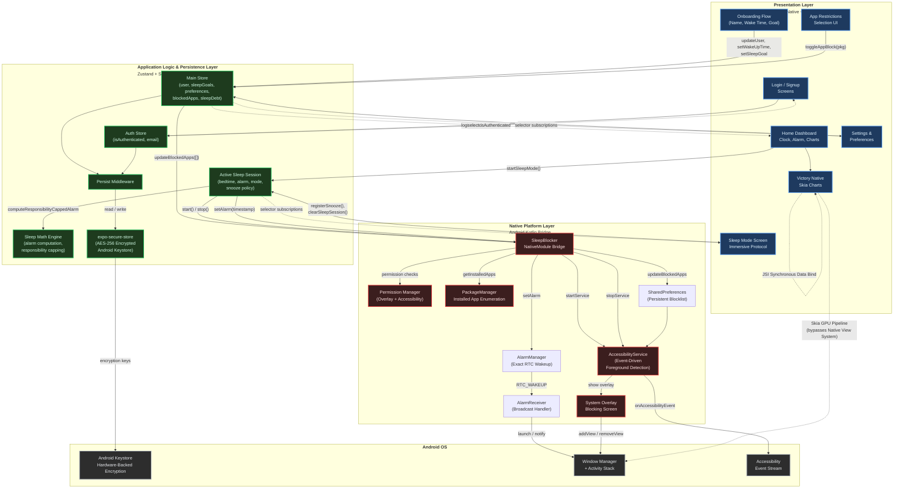
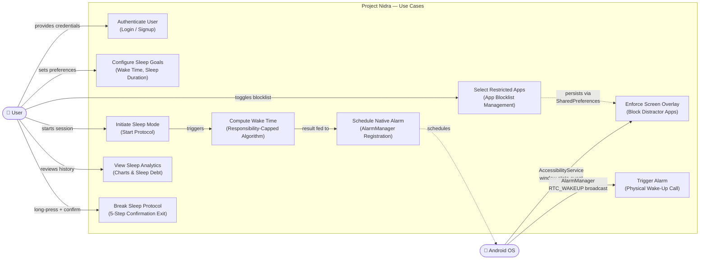
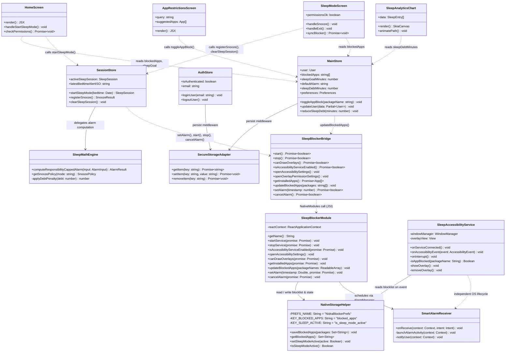
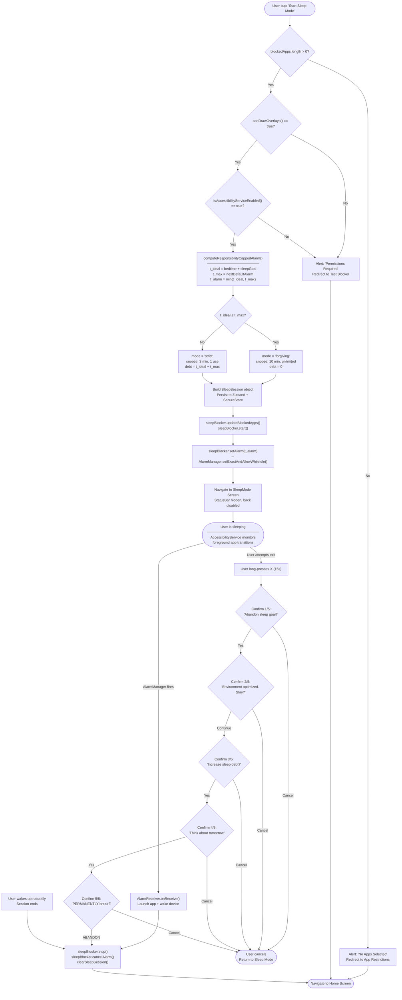
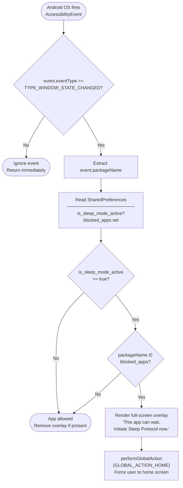
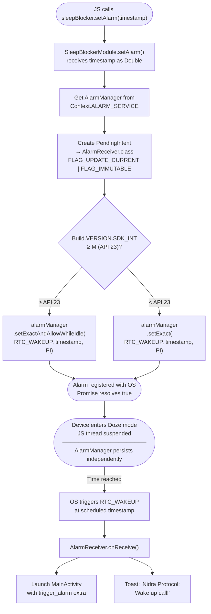

# 5.1 System Architecture

System architecture describes the overall structure, organization, and behavioral framework of a software system. It delineates how discrete components interact, communicate, and coordinate to fulfill the functional and non-functional requirements of the application. For Project Nidra—a sleep-enforcement and behavioral-modification platform for Android—the architecture is organized into three distinct layers: the **Presentation Layer** (React Native UI), the **Application Logic & Persistence Layer** (Zustand State Management with SecureStore), and the **Native Platform Layer** (Android Kotlin Bridge with AccessibilityService). Each layer operates with a clear separation of concerns, communicating through well-defined interfaces to ensure maintainability, security, and performance.

---

## 5.1.1 Presentation Layer — React Native UI

The user-facing layer of Project Nidra is implemented as an Expo-managed React Native application utilizing `expo-router` for declarative, file-system-based navigation. The interface employs a custom frosted-glass design language—characterized by translucent card surfaces, subtle background blurs, and a curated dark color palette—to evoke a calm, sleep-conducive visual environment. Typography is served via Google Fonts (`Inter` for interface elements, `Lora` for emotive headings), loaded at the root layout level to guarantee typographic consistency across all screens.

For data visualization, the application integrates `victory-native`, a high-performance charting library built on `@shopify/react-native-skia`. By utilizing the **JavaScript Interface (JSI)**, the application achieves synchronous data synchronization between the Zustand state and the native rendering engine, eliminating the overhead of asynchronous JSON serialization over the legacy bridge. The Skia-backed pipeline offloads drawing operations directly to the GPU, bypassing the standard **Android View Hierarchy** for complex path rendering. This ensures smooth 60fps animations for weekly sleep-trend graphs even during high-frequency state updates.

The Presentation Layer does not manage application state directly. Instead, each screen component subscribes to specific slices of the global Zustand store via typed selector functions, ensuring minimal re-renders and a unidirectional data flow from state to view.

---

## 5.1.2 Application Logic & Persistence Layer — Zustand with SecureStore

The core application logic resides in a centralized Zustand store that governs all mutable application state, including user identity, sleep goals, alarm configurations, active sleep sessions, blocked application lists, accumulated sleep debt, and user preferences. Zustand was selected for its minimal API surface, lack of boilerplate, and native support for middleware composition—qualities that are critical in a resource-constrained mobile environment.

State persistence is achieved through Zustand's `persist` middleware, configured with a custom storage adapter backed by `expo-secure-store`. Unlike conventional `AsyncStorage`-based solutions, SecureStore leverages the Android Keystore system to encrypt all persisted data at rest, ensuring that sensitive user information (email, sleep patterns, behavioral data) is protected against unauthorized access even on compromised devices. The store hydrates automatically on application launch, restoring the user's complete session state—including any active sleep protocol—without requiring re-authentication.

The store also encapsulates all domain logic as co-located actions: sleep-mode initiation (with responsibility-capped alarm computation), snooze registration (with mode-aware quotas), sleep-debt accumulation, and session lifecycle management. This architectural decision ensures that business rules are enforced consistently regardless of which UI screen triggers the operation.

---

## 5.1.3 Native Platform Layer — Android Kotlin Bridge with AccessibilityService

The most architecturally distinctive layer of Project Nidra is its native Android module, implemented in Kotlin and exposed to the React Native runtime via a custom `NativeModule` bridge (`SleepBlocker`). This module provides capabilities that are fundamentally inaccessible from the JavaScript layer: system overlay rendering, accessibility-based foreground detection, installed application enumeration, and dynamic app blocking.

The blocking mechanism is powered by an Android `AccessibilityService`—a system-level service that receives callbacks on window state changes across the entire operating system. To ensure resilience against service restarts or system-level process termination, the list of restricted applications is persisted natively via `SharedPreferences`. When the Sleep Protocol is active, the service maintains this blocklist in memory for high-performance lookups but synchronizes state with the persistent disk storage whenever the JS layer updates the configuration. Upon detecting a foreground transition to any blocked application, the service immediately renders a full-screen system overlay instructing the user to return to sleep, effectively preventing interaction with the restricted application. This approach is significantly more power-efficient than polling-based alternatives, as the service is event-driven and consumes negligible CPU resources during idle periods.

The React Native layer communicates with this native module through a typed bridge interface that exposes the following operations: `startService`, `stopService`, `canDrawOverlays`, `isAccessibilityServiceEnabled`, `openOverlayPermissionSettings`, `openAccessibilitySettings`, `getInstalledApps`, `updateBlockedApps`, `setAlarm`, and `cancelAlarm`. All permission-gated operations include pre-flight checks surfaced to the UI layer, enabling the application to guide users through the Android permission grant flow before activating the blocking engine or scheduling precision alarms.

---

## 5.1.4 System Architecture Diagram



---

## 5.1.5 Inter-Layer Communication Summary

| Communication Path | Mechanism | Data Flow |
|---|---|---|
| UI → State | Zustand typed selectors & action dispatches | User interactions trigger store mutations |
| State → UI | Reactive subscriptions (auto re-render on slice change) | State changes propagate to subscribed components |
| State → Persistence | Zustand `persist` middleware | Automatic serialization to encrypted SecureStore |
| State → Native | `NativeModules.SleepBlocker` bridge calls | Blocked app list sync, service start/stop |
| Native → OS | AccessibilityService event callbacks | Foreground app detection, overlay rendering |
| Native → UI | Promise-based async returns | Permission status, installed app enumeration |

The three-layer architecture of Project Nidra ensures that the user interface remains decoupled from platform-specific enforcement logic, the application state serves as a single source of truth with encrypted persistence, and the native blocking engine operates at the OS level with minimal resource consumption. This separation enables independent evolution of each layer while maintaining strict behavioral contracts at layer boundaries.

---

# 5.2 UML Diagrams

UML (Unified Modeling Language) diagrams provide a standardized visual representation of the system's behavioral structure and class relationships. Section 5.2 presents two complementary views: a Use Case Diagram that maps the interactions between actors and system features, and a Class Diagram that defines the structure and relationships of the key software entities across all three architectural layers.

---

## 5.2.1 Use Case Diagram

The Use Case Diagram captures the functional scope of Project Nidra from the perspective of its two primary actors: the **User** (the human operating the application) and the **Android OS** (the system-level agent responsible for autonomously triggering scheduled operations while the React Native JS thread is suspended).



---

## 5.2.2 Class Diagram

The Class Diagram delineates the structural relationships between the principal software entities across the three architectural layers. It specifies key attributes, method signatures, and dependency relationships to form a complete object-level view of the system.



---

## 5.2.3 Diagram Summary

| Diagram | Purpose | Key Insight |
|---|---|---|
| **Use Case** | Maps actor–system interactions | The Android OS is a distinct, autonomous actor that triggers blocking and alarm events independently of the user |
| **Class Diagram** | Defines entity structure and relationships | The `NativeStorageHelper` decouples the blocklist persistence from both the JS state and the running service, ensuring lifecycle safety |

---

# 5.3 Flowcharts

Flowcharts are graphical representations of the step-by-step process followed in the system. They illustrate how data moves through architectural layers, how decisions are evaluated, and how different processes are executed from start to end. The following flowcharts capture the three most critical operational flows within Project Nidra.

---

## 5.3.1 Sleep Protocol Lifecycle Flowchart

This flowchart traces the complete lifecycle of a Sleep Mode session—from the user pressing "Start Sleep Mode" on the Home Screen, through the permission verification gate, the Responsibility-Capped alarm computation, the native service activation, and finally the two possible termination paths: a natural alarm wake-up or a manual 5-step protocol break.



---

## 5.3.2 App Blocking Enforcement Flowchart

This flowchart details the event-driven blocking mechanism that runs entirely at the Android OS level, independent of the React Native JavaScript thread. It shows how the `AccessibilityService` intercepts window state changes and decides whether to display a blocking overlay.



---

## 5.3.3 Native Alarm Scheduling Flowchart

This flowchart traces the alarm lifecycle from the moment the JavaScript layer requests a wake-up to the point the Android OS physically wakes the device.



---

# 5.4 Algorithm

The core algorithmic logic of Project Nidra centers on the **Responsibility-Capped Alarm** computation—a deterministic function that resolves the tension between a user's desired sleep duration and their real-world obligations (represented by a preset alarm). This algorithm governs the session mode, snooze policy, and accumulated sleep debt for every session.

---

## 5.4.1 Responsibility-Capped Alarm Algorithm

### Problem Statement

Given a user who goes to bed at time `t_bed` with a desired sleep duration of `G` minutes and a preset default alarm at `t_default`, compute the actual alarm time `t_alarm` that satisfies:

> **t_alarm = min(t_ideal, t_default)**

Where `t_ideal = t_bed + G`. If the user went to bed too late to achieve their full sleep goal before their obligation alarm, the system must cap the alarm, switch to strict behavioral mode, and record the resulting sleep debt.

### Pseudocode

```
ALGORITHM: ComputeResponsibilityCappedAlarm
─────────────────────────────────────────────

INPUT:
    t_bed           ← Current bedtime (timestamp)
    G               ← Sleep goal (minutes)
    alarm_default   ← User's preset alarm (HH:MM AM/PM)

OUTPUT:
    t_alarm         ← Actual alarm time (timestamp)
    mode            ← 'forgiving' | 'strict'
    debt            ← Minutes of sleep debt added

BEGIN
    // Step 1: Compute the ideal wake-up time
    t_ideal ← t_bed + (G × 60 × 1000)     // milliseconds

    // Step 2: Resolve the next occurrence of the default alarm
    t_default ← BuildNextAlarmDate(t_bed, alarm_default)
        // If alarm_default time has already passed today,
        // advance to tomorrow

    // Step 3: Apply the responsibility cap
    IF t_ideal ≤ t_default THEN
        // User went to bed early enough
        t_alarm ← t_ideal
        mode    ← 'forgiving'
        debt    ← 0
    ELSE
        // User went to bed too late — cap at obligation
        t_alarm ← t_default
        mode    ← 'strict'
        debt    ← ROUND((t_ideal − t_default) / 60000)
    END IF

    RETURN { t_alarm, mode, debt }
END
```

### Snooze Policy Derivation

```
ALGORITHM: GetSnoozePolicy
─────────────────────────────────────────────

INPUT:
    mode ← 'forgiving' | 'strict'

OUTPUT:
    interval    ← Snooze duration (minutes)
    max_snoozes ← Maximum allowed snoozes

BEGIN
    IF mode = 'strict' THEN
        interval    ← 3
        max_snoozes ← 1
    ELSE
        interval    ← 10
        max_snoozes ← 99    // effectively unlimited
    END IF

    RETURN { interval, max_snoozes }
END
```

### Snooze Registration

```
ALGORITHM: RegisterSnooze
─────────────────────────────────────────────

INPUT:
    session ← Active SleepSession

OUTPUT:
    allowed     ← Boolean
    remaining   ← Snoozes left
    interval    ← Minutes snoozed

BEGIN
    IF session = NULL THEN
        RETURN { allowed: false, remaining: 0, interval: 0 }
    END IF

    next_used ← session.snoozesUsed + 1

    IF next_used > session.maxSnoozes THEN
        RETURN { allowed: false, remaining: 0, interval: session.interval }
    END IF

    // Advance the alarm by the snooze interval
    session.actualAlarmTime ← session.actualAlarmTime + (session.interval × 60 × 1000)
    session.snoozesUsed ← next_used
    remaining ← session.maxSnoozes − next_used

    RETURN { allowed: true, remaining, interval: session.interval }
END
```

---

## 5.4.2 Algorithm Complexity Analysis

| Algorithm | Time Complexity | Space Complexity | Notes |
|---|---|---|---|
| `ComputeResponsibilityCappedAlarm` | O(1) | O(1) | Pure arithmetic comparison; no iteration |
| `GetSnoozePolicy` | O(1) | O(1) | Single conditional branch |
| `RegisterSnooze` | O(1) | O(1) | In-place mutation of session state |
| `IsAppBlocked` (native) | O(1) amortized | O(n) | `HashSet.contains()` lookup against n blocked apps |
| `BuildNextAlarmDate` | O(1) | O(1) | Date arithmetic with single comparison |

All core algorithms execute in constant time, ensuring zero perceptible latency during user interactions and negligible CPU overhead during the event-driven blocking loop.
